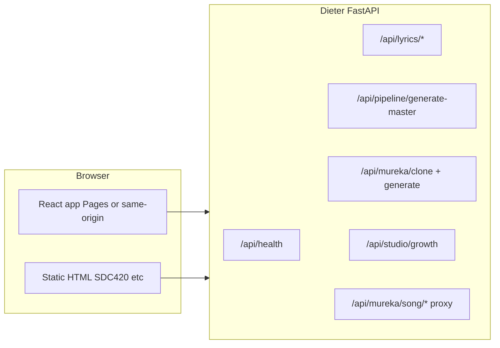

# Dieter Esq. — stack, pipeline, deploy

**Start here for the full app (one URL):** [`DIETER_ESQ_START.md`](./DIETER_ESQ_START.md)

---

## Railway vs VPS (choice: **Railway** for the API)

| | **Railway** | **VPS** |
|---|-------------|---------|
| Ops | Low: Git push, HTTPS, `PORT` injected | You manage OS, TLS, systemd, updates |
| Fit here | Matches existing `dieter-backend/Dockerfile` + Gunicorn | Same container, more setup |
| Cost | Usage-based free tier / hobby | Fixed server + time |

Use **Railway** for the FastAPI + static bundle. Use a **VPS** later if you need GPUs (RVC training), huge disks, or full control.

## End-to-end pipeline

1. **Lyrics** — Generate/optimize via OpenAI or local templates (`/api/lyrics/*`). Events increment **studio growth** counters.
2. **Local lab** — Beat upload, procedural vocal, FFmpeg merge; URLs resolved against **API origin** (works when UI is on Cloudflare and API on Railway).
3. **Beat lab** — Waveform + analyze; **Beat lab pro** runs **generate-master**; counters updated.
4. **Voice studio** — Reference upload → `mureka/clone`; mix → `mureka/generate` (Coqui + F0 when installed).
5. **Cloud create** — Mureka proxy with your key; **mureka_songs** counter increments.
6. **Growth** — `data/studio_growth.json` on the server tracks cumulative activity (replace with DB when you scale).

## Deploy paths

### A) Single container (**recommended — full working app**)

- **Railway** (or Render): build **`dieter-backend/Dockerfile`** with context = **repository root** (`railway.toml` does this).
- **One public URL**: React at **`/`**, API at **`/api`** (no static-only workflow, no `?api=`).
- Env on the host: `MUREKA_API_KEY`, `OPENAI_API_KEY`, optional `DIETER_CORS_ORIGINS` (only if you later split origins).

### B) Split front + API (optional advanced)

1. **Railway**: deploy from repo root; `railway.toml` points at `dieter-backend/Dockerfile`.
2. Copy the public URL, e.g. `https://dieter-api-production.up.railway.app`.
3. **Cloudflare Pages**: connect `mureka-clone`, build command `npm run build`, output `dist`.
4. **Environment variables (Pages build)**:
   - `VITE_API_BASE=https://YOUR_RAILWAY_HOST/api`
5. **Railway variables** (optional, stricter CORS):
   - `DIETER_CORS_ORIGINS=https://YOUR_PAGES_DOMAIN`
6. **Static HTML** (`/dieter-sdc420.html`): open with query `?api=https://YOUR_RAILWAY_HOST/api`.

### Frontend deploy script (Pages)

From `mureka-clone`: copy `.env.deploy.example` → `.env.deploy`, add `CLOUDFLARE_API_TOKEN`, run `npm run deploy`.

## Local dev

- `mureka-clone`: `npm run dev` — proxies `/api` to `http://127.0.0.1:8000` (override with `API_PROXY_TARGET`).
- `dieter-backend`: `uvicorn app.main:app --reload --port 8000` (or your usual port).
