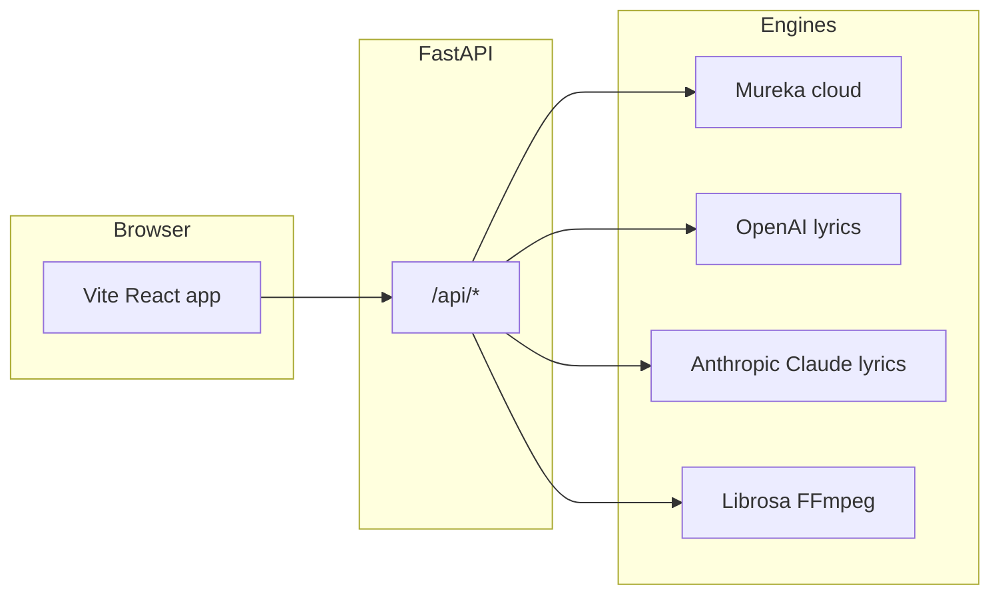

# Application map — how Dieter Esq. fits together

Use this when onboarding engineers or deciding where to add a feature. The **canonical production path** is: **React UI** → **FastAPI gateway** → **Mureka / DSP / optional LLMs**.

## High-level flow

## UI surface (`mureka-clone/`)

| Area | Purpose |
|------|---------|
| **Create** | Mureka prompts through `/api/mureka/*` (gateway-first). |
| **Cloud** | Advanced lyrics + style form → same Mureka path. |
| **Lyrics API** | `POST /api/lyrics/analyze` — lint & BPM hints; `POST /api/lyrics/prosody` — optional per-line syllables + naive rhyme sketch. |
| **Voice studio** | Voice / clone flows via gateway. |
| **Beat lab / Local** | Server FFmpeg/librosa pipelines; **procedural** draft vocal stems only—**not** Mureka singers. |
| **Connections** | Keys: Mureka, OpenAI, **Anthropic (Claude)**, API base. |

Lyrics **Generate / Optimize** call `POST /api/lyrics/generate` and `POST /api/lyrics/optimize`. The server tries LLM providers in **`DIETER_LYRICS_AI_ORDER`** (default `openai,anthropic`), then falls back to **local templates**.

## Backend (`dieter-backend/`)

| Concern | Location |
|---------|-----------|
| Mureka proxy, retries | `app/main.py`, Mureka client modules |
| Lyrics LLMs | `app/lyrics_service.py` (OpenAI + Anthropic HTTP, no extra deps) |
| Vocal features (training labels) | `POST /api/vocal/analyze` → `app/vocal_analysis.py` |
| Beat / pitch / mix | `app/local_pipeline.py`, `app/beat_lab.py`, etc. |
| Optional tRPC bridge | `dieter-trpc/` (dev or `VITE_USE_TRPC`) |

## Performance build (frontend)

Production `npm run build` uses **Vite 8** with:

- **Minify** via the default toolchain, **`target: es2022`**, **CSS minify**
- **`manualChunks`**: separate bundles for React (`vendor-react`), tRPC (`vendor-trpc`), WaveSurfer (`vendor-wavesurf`) for caching and parallel load
- **`esbuild`** is listed as a **devDependency** so Vite can transpile chunks (required with the current Vite + Rolldown pipeline)

See `mureka-clone/vite.config.js`.

## Environment variables (common)

| Variable | Role |
|----------|------|
| `MUREKA_API_KEY` | Server-side Mureka |
| `OPENAI_API_KEY` | Lyrics when OpenAI is tried first / only |
| `ANTHROPIC_API_KEY` | Lyrics via Claude |
| `ANTHROPIC_MODEL` | Override model id (default `claude-3-5-haiku-20241022`) |
| `DIETER_LYRICS_AI_ORDER` | e.g. `anthropic,openai` to prefer Claude |
| `VITE_API_BASE` | Split deploy: full URL to `/api` on FastAPI |

## Further reading

- [`GATEWAY_ARCHITECTURE.md`](./GATEWAY_ARCHITECTURE.md)
- [`VOCAL_ENGINE_AND_TRAINING.md`](./VOCAL_ENGINE_AND_TRAINING.md)
- [`DIETER_ESQ_START.md`](../DIETER_ESQ_START.md)
